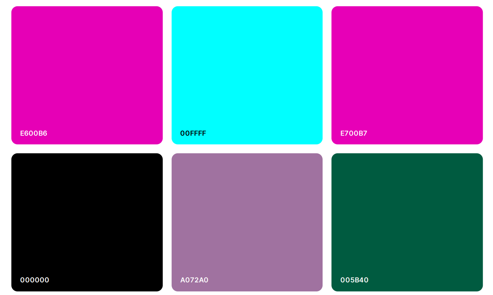

 

## Introduction

March 2023 Women in Tech hackathon.

Women working are often underrepresented in technical roles, particularly in leadership positions. This can create a culture where women feel isolated and excluded, and may not have role models or mentors to support their career development.

 

## Table of Contents
​
* [Introduction](#introduction)
* [User Experience](#user-experience)
    * [User stories](#user-stories)
* [Technology](#technology)
  * [Tech Stack](#tech-stack)
  * [Languages](#languages)
* [Initial MVP Idea](#initial-mvp-idea)
  * [Actual idea & content](#actual-idea--content)
  * [Future Development](#future-development)
* [Design](#design)
  * [Color Scheme](#color-scheme)
  * [Typography](#typography)
  * [Imagery](#imagery)
    * [Logo](#logo)
  * [Wireframes](#wireframes)
* [Deployment & Usage](#deployment--usage)
  * [Remote Deployment](#remote-deployment)
  * [How To Fork](#how-to-fork)
  * [How To Clone](#how-to-clone)
* [Testing](#testing)
* [Credits](#credits)
  * [Content](#content)
  * [Media](#media)
  * [Acknowledgements](#acknowledgements)
 

## User Experience

* Easily navigate website content and pages
* Ability to contact individuals to request mentorship
* "ADD MORE DETAILS HERE"
 

### User stories

* As a woman in a technical role and user of the Fem Code website, I want to be able to connect with other women in similar positions to share experiences, advice, and support. I would like the website to provide a platform for networking and community building, with features such as a forum, groups, and events. 
    * End user goal:  
    * Acceptance criteria: 
    * Measurement of success:

* As a woman in a technical role and user of the Fem Code website, I want to be able to connect with experienced women in my field to learn from their experiences and get advice on navigating my career. I would like the website to offer a mentorship program that matches me with a mentor who can provide guidance and support.
    * End user goal:  
    * Acceptance criteria: 
    * Measurement of success:
 
* As a woman aspiring to a leadership role in a technical field and user of the Fem Code website, I want to be able to access resources and guidance on career development, leadership skills, and overcoming gender bias. I would like the website to offer  articles, webinars and training courses tailored to women in tech.
    * End user goal:  
    * Acceptance criteria: 
    * Measurement of success:

 

## Technology
### Tech Stack
### Languages

 

## Initial MVP Idea
### Actual idea & content
### Future Development

 

## Design
### Color Scheme
The colour palette uses colours from the FemCode logo.

- #E600B6
- #00FFFF
- #E700B7 
- #000000
- #A072A0
- #005B40

### Typography
Roboto and Sans Serrif were identified as suitable fonts to be used on the website​

### Imagery
INSERT LINKS HERE AS TO WJERE IMAGES WERE TAKEN

#### Logo

[Canva](https://www.canva.com/) was used to create the Fem Code Logo

INSERT LINKS HERE AS TO WHERE THE LOGO WAS CREATED

### Wireframes

 

## Deployment & Usage
### Remote Deployment
### How To Fork
### How To Clone

 

## Testing

 

## Credits
### Content
### Media
### Acknowledgements
Thanks to the Code Institute's hackteam for another great hackathon.

This project was developed by:

[Kyle](https://github.com/KTC96)

[Peter](https://github.com/panzek)

[Carmen](https://github.com/CarmenCantudo)

[Kayla](https://github.com/Kaylaesmith1)

[Pedro](https://github.com/PedroCristo)

[Hashim](https://github.com/hashim222)

[Chris](https://github.com/CMed01)
