 

## Introduction

March 2023 Women in Tech hackathon.

Women working are often underrepresented in technical roles, particularly in leadership positions. This can create a culture where women feel isolated and excluded, and may not have role models or mentors to support their career development.

[Live preview for the site](https://panzek.github.io/fem-code/)

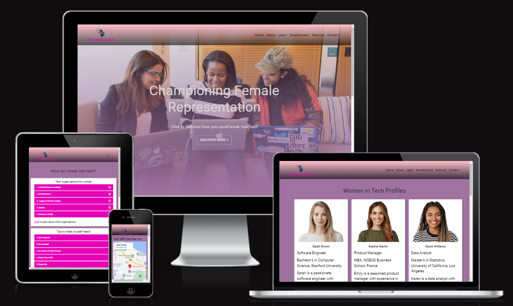

 

## Table of Contents
​
* [Introduction](#introduction)
* [User Experience](#user-experience)
    * [User stories](#user-stories)
* [Technology](#technology)
  * [Tech Stack](#tech-stack)
  * [Languages](#languages)
* [Initial MVP Idea](#initial-mvp-idea)
  * [Actual idea & content](#actual-idea--content)
  * [Future Development](#future-development)
* [Design](#design)
  * [Color Scheme](#color-scheme)
  * [Typography](#typography)
  * [Imagery](#imagery)
    * [Logo](#logo)
  * [Wireframes](#wireframes)
* [Deployment & Usage](#deployment--usage)
  * [Remote Deployment](#remote-deployment)
  * [How To Fork](#how-to-fork)
  * [How To Clone](#how-to-clone)
* [Testing](#testing)
* [Credits](#credits)
  * [Content](#content)
  * [Media](#media)
  * [Acknowledgements](#acknowledgements)
 

## User Experience

* Easily navigate website content and pages
* Ability to contact individuals to request mentorship
* "ADD MORE DETAILS HERE"
 

### User stories

* As a woman in a technical role and user of the Fem Code website, I want to be able to connect with other women in similar positions to share experiences, advice, and support. I would like the website to provide a platform for networking and community building, with features such as a forum, groups, and events. 

* As a woman in a technical role and user of the Fem Code website, I want to be able to connect with experienced women in my field to learn from their experiences and get advice on navigating my career. I would like the website to offer a mentorship program that matches me with a mentor who can provide guidance and support.
 
* As a woman aspiring to a leadership role in a technical field and user of the Fem Code website, I want to be able to access resources and guidance on career development, leadership skills, and overcoming gender bias. I would like the website to offer  articles, webinars and training courses tailored to women in tech.

 

## Technology
### Tech Stack

<!-- * Google APP Script was used to create the contact form. -->
* Bootstrap: Boostrap enables building of webpages quickly, which is key in short turnaround project.
* Git
* GitHub
* GitHub Pages

### Languages

* HTML: HTML was used to create the basic architecture of our website.
* CSS: We used CSS to style our HTML elements.
* JavaScript: We used JavaScript to enhance the map functions.

* Tools
  * [Coolors](https://coolors.co/): Coolors was used to create the color palette.
  * [Google Fonts](https://fonts.google.com/): Google Fonts was used to select the fonts.
  * [Stack Overflow](https://stackoverflow.com/): Stack Overflow was used to improve CSS design.
  * [Canva](https://www.canva.com/): Used to create the favicon.
  * [Am I Responsive](https://ui.dev/amiresponsive): Used to test website responsiveness.

 

## Initial MVP Idea
### Actual idea & content

#### Content
The following website were used to create and develop content for Fem Code website.

* [CIO](https://www.cio.com/article/215709/16-organizations-for-women-in-tech.html): Information taken to populate groups for women in tech
* [Wired](https://www.wired.com/insights/2013/08/breaking-into-tech-5-tips-for-women/): Information taken to populate tips for women working in tech.
* [Tech Target](https://www.techtarget.com/whatis/feature/Top-9-most-influential-women-in-technology): Information taken to populate top women in tech.

### Future Development

 

## Design
### Color Scheme
The colour palette uses colours from the FemCode logo.

- #000000
- #E600B6
- #A072A0
- #FFC0CB
- #0F916A
- #E9ECEF
- #DADADA
- #FFFFFF

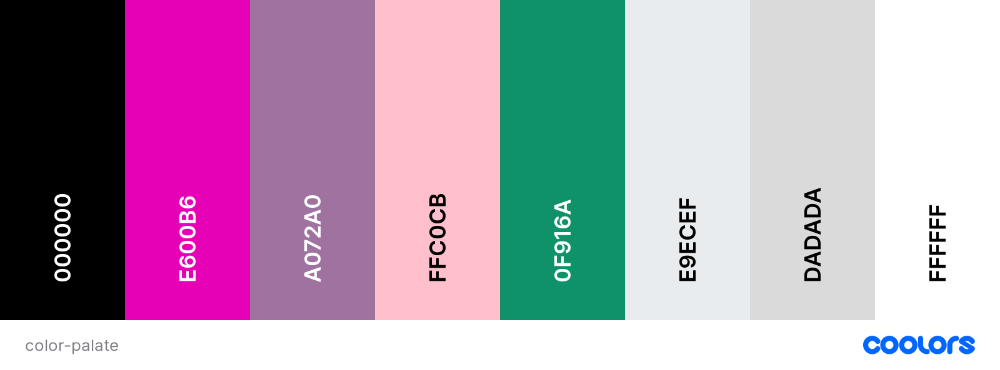

### Typography
Roboto and Sans Serrif were identified as suitable fonts to be used on the website​

### Imagery
[Unsplash](https://unsplash.com/) and [Freepik](https://www.freepik.com/) were used to source copyright free images for the website gallery

#### Logo

[Canva](https://www.canva.com/), [Photopea](https://www.photopea.com/), [Pixlr](https://pixlr.com/)  was used to create the Fem Code Logo

### Wireframes

Desktop and mobile wireframes

* Landing Page

Desktop                 |  Mobile                                 
:----------------------:|:----------------------:|
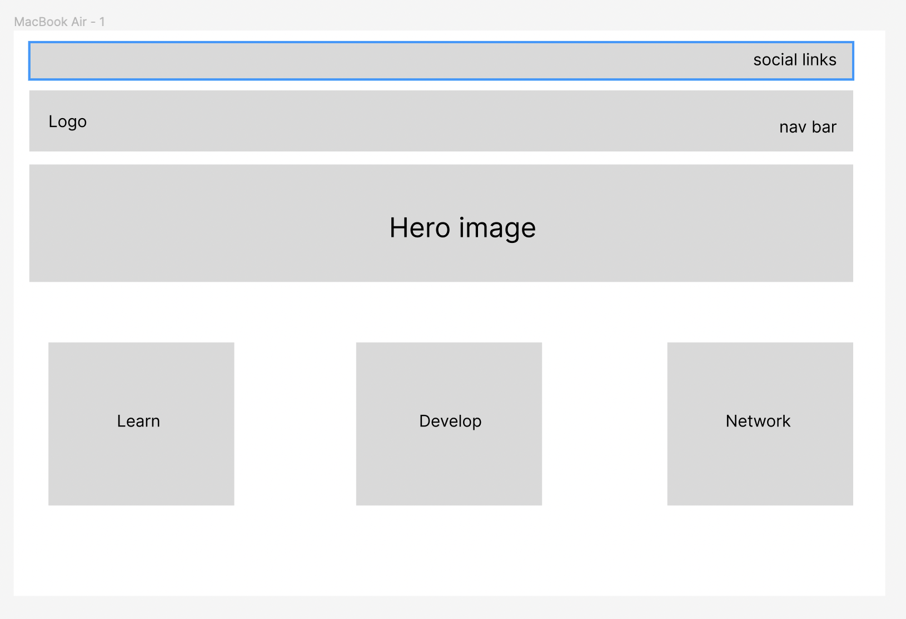   |  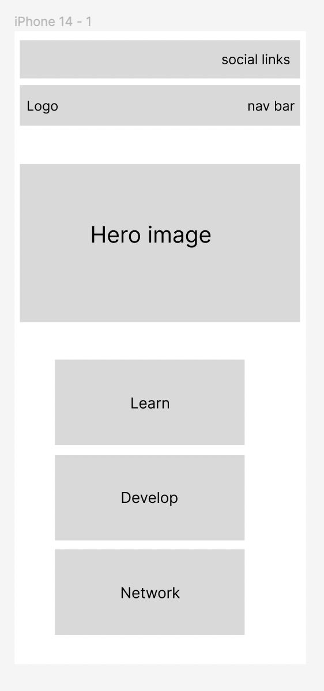

* Learn Page

Desktop                 |  Mobile                                 
:----------------------:|:----------------------:|
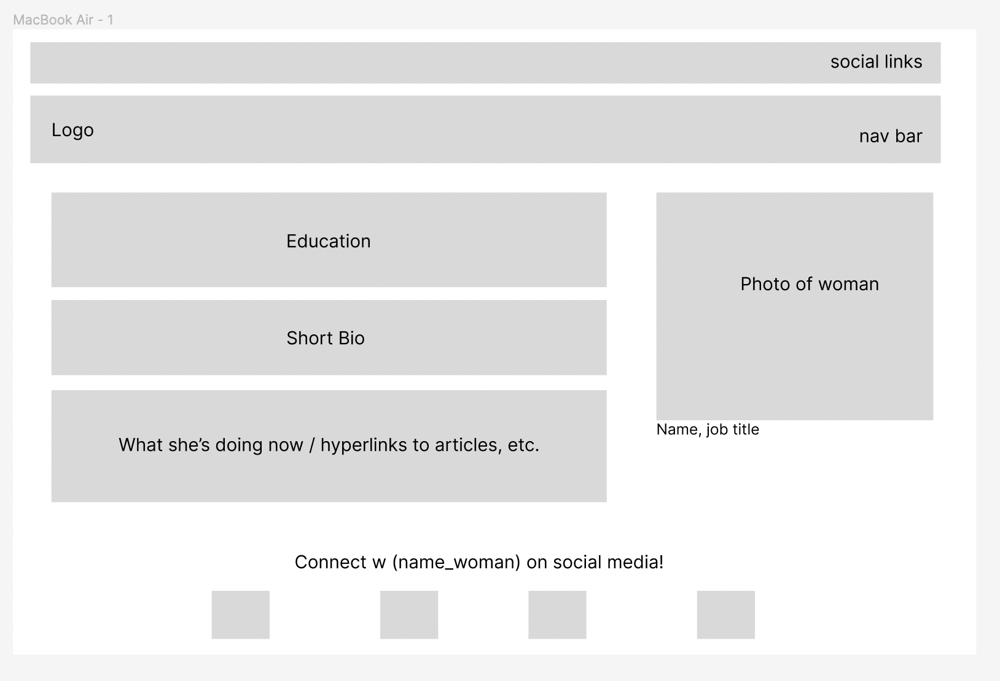   |  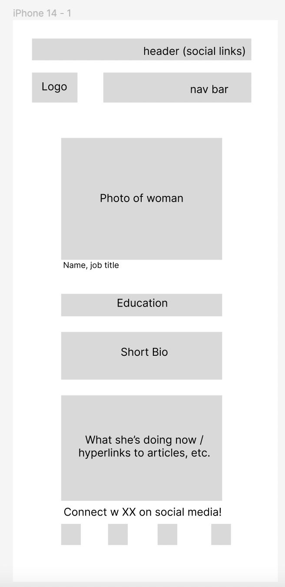

* Develop Page

Desktop                 |  Mobile                                 
:----------------------:|:----------------------:|
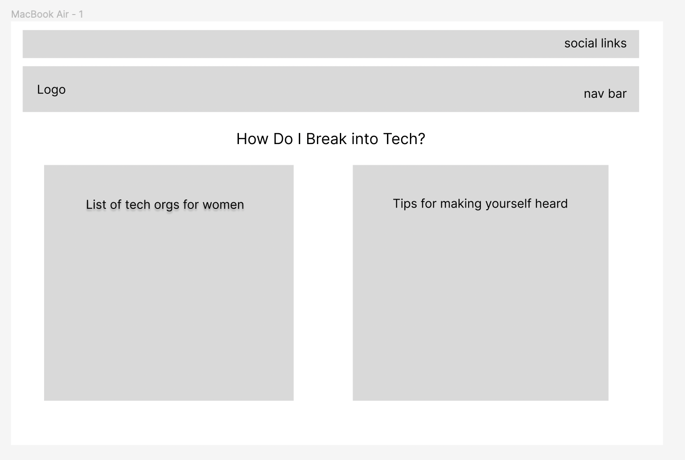   |  

* Network Page

Desktop                 |  Mobile                                 
:----------------------:|:----------------------:|
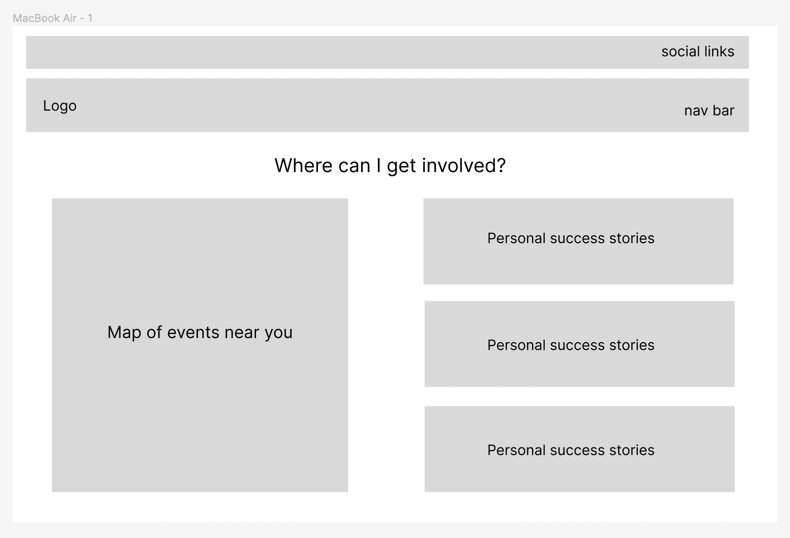   |  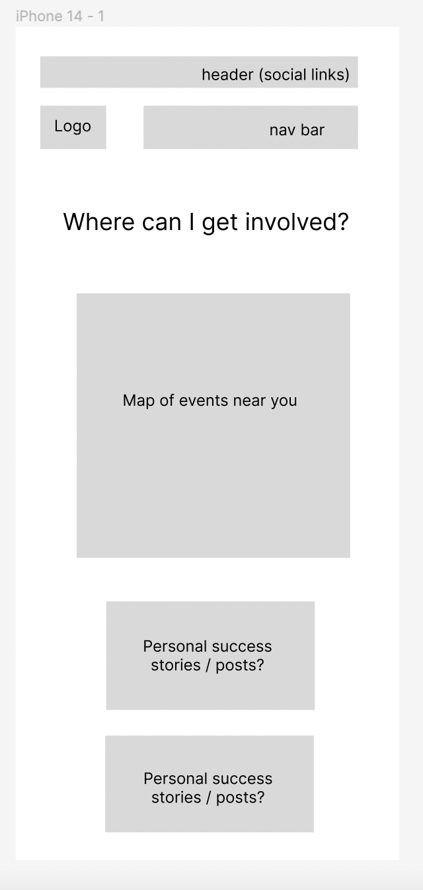

 

## Deployment & Usage
### Remote Deployment
The site was deployed to GitHub pages. In order to deploy the website, the following steps were taken:
* In the GitHub repository, navigate to the Settings tab
* On the left side menu, on the section Code and automation, click on Pages.
* From the source section drop-down menu, select the Deploy from a branch.
* From the branch section drop-down menu, select main, right on the side select /root.
* Once the the branch menus have been selected, github will create the page. It might take a few minutes. Once it is done a link will show up on the top of the page.
* The live link can be found here: [Fem Code](https://panzek.github.io/fem-code/).

### How To Fork
To fork the repository:
* Log in (or sign up) to [Github](https://github.com/).
* Go to the repository for this project: [Fem Code](https://github.com/panzek/fem-code).
* Click the Fork button in the top right corner.

### How To Clone

To clone the repository:
* Log in (or sign up) to [Github](https://github.com/).
* Go to the repository for this project: [Fem Code](https://github.com/panzek/fem-code).
* Click on the code button, select whether you would like to clone with HTTPS, SSH or GitHub CLI and copy the link shown.
* Open the terminal in your code editor and change the current working directory to the location you want to use for the cloned directory.
* Type 'git clone' into the terminal and then paste the link you copied in step 3.
* Press enter.

 

## Testing

* Navbar: All the links on the navbar are working.
  * I clicked on the logo and it took me to the index.html page
  * I clicked on Home and it took me to the index.html page
  * I clicked on About and it took me to the about.html page
  * I clicked on Learn and it took me to the learn.html page
  * I clicked on Development and it took me to the development.html page
  * I clicked on Network and it took me to the network.html page
   * I clicked on Contact and it took me to the contact.html page
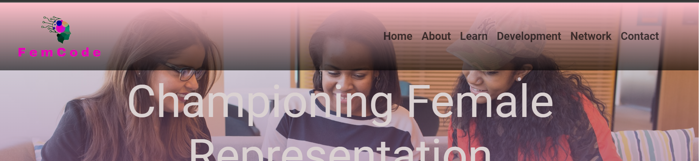

 

* Footer: All the links on the footer are working.
  * I clicked on the link of each social media icon and a new tab with the correct social media site opened.
  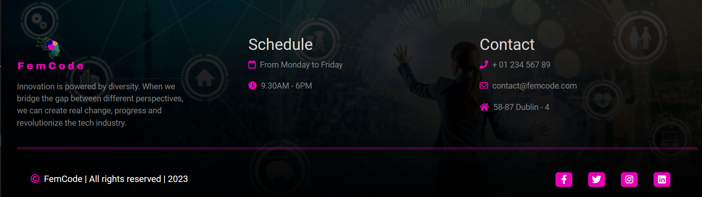

   

* Home: All the card cateogries and links are working.
  * I clicked on the "Discover More" button and the page moved to the three cards below the hero image. 
  * I clicked on the "Learn" card and it took me the learn.html page.
  * I clicked on the "Develop" card and it took me the develop.html page.
  * I clicked on the "Newtwork" card and it took me the network.html page.
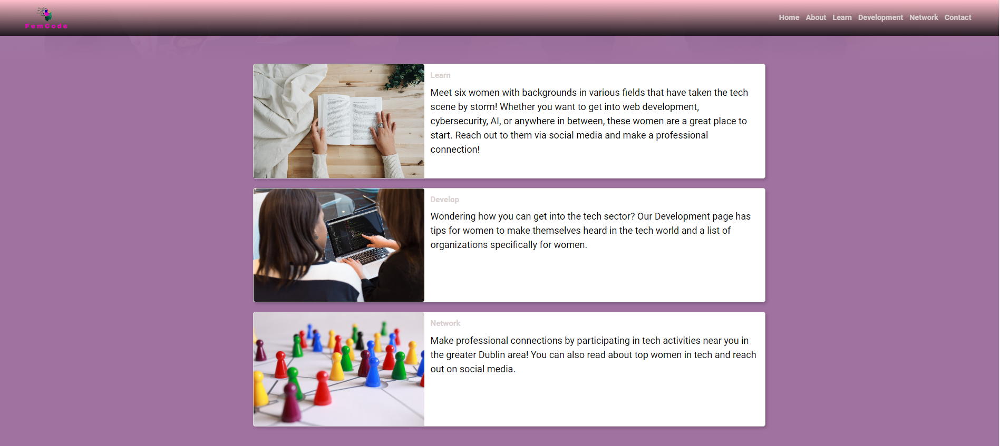

 

* About: All the images are working. When I hover the mouse on the images, the developer name appears and a clickable link to the respective github page. 

 

* Learn: All the social media links are working. No effect when hovering, but when clicked the respective social media website is opened in a new tab.

 

* Development: Both dropdown menu links are working When clicked the specific section expands and when clicked again collapses. In the tech organisations for women box, all the respective link are working and when clicked open a new tab with the correct corresponding webpage.

 

* Network: All the images are working. The map is interactive and functioning. The links for each successful women card is working and when clicked opens to a new tab to the correct correspodning website. When hovering over social media icons the color changes and when clicked they open to the correct corresponding social media accounts. 

 

* Contact: 

 

* 404: When I try to access a page that does not exist, the 404.html page is shown.

 

## Credits
### Content

### Media

### Acknowledgements
Thanks to the Code Institute's hackteam for another great hackathon.

This project was developed by:

[Kyle](https://github.com/KTC96)

[Peter](https://github.com/panzek)

[Carmen](https://github.com/CarmenCantudo)

[Kayla](https://github.com/Kaylaesmith1)

[Pedro](https://github.com/PedroCristo)

[Hashim](https://github.com/hashim222)

[Chris](https://github.com/CMed01)
